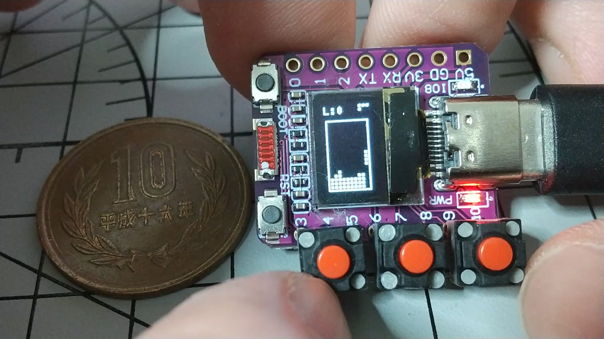
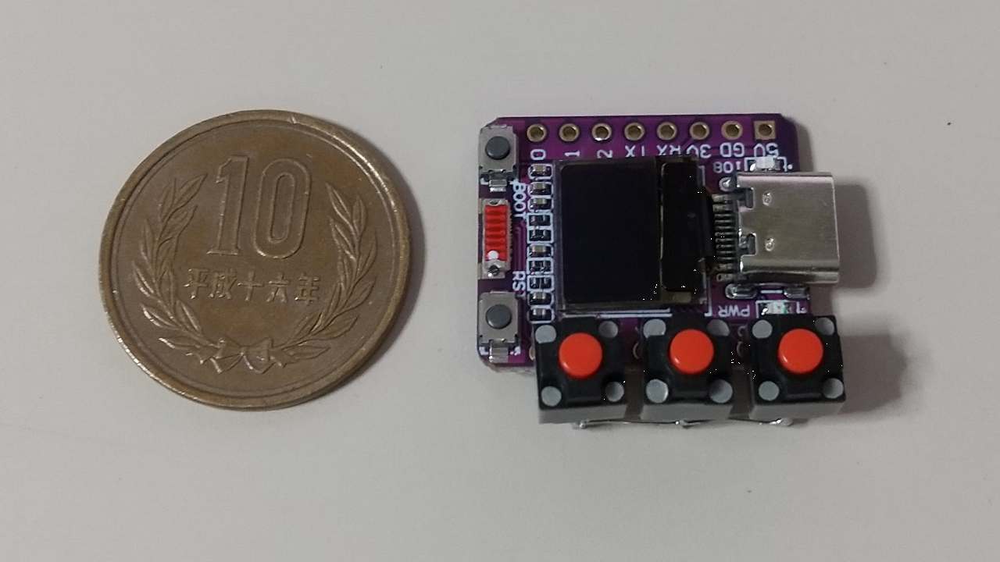
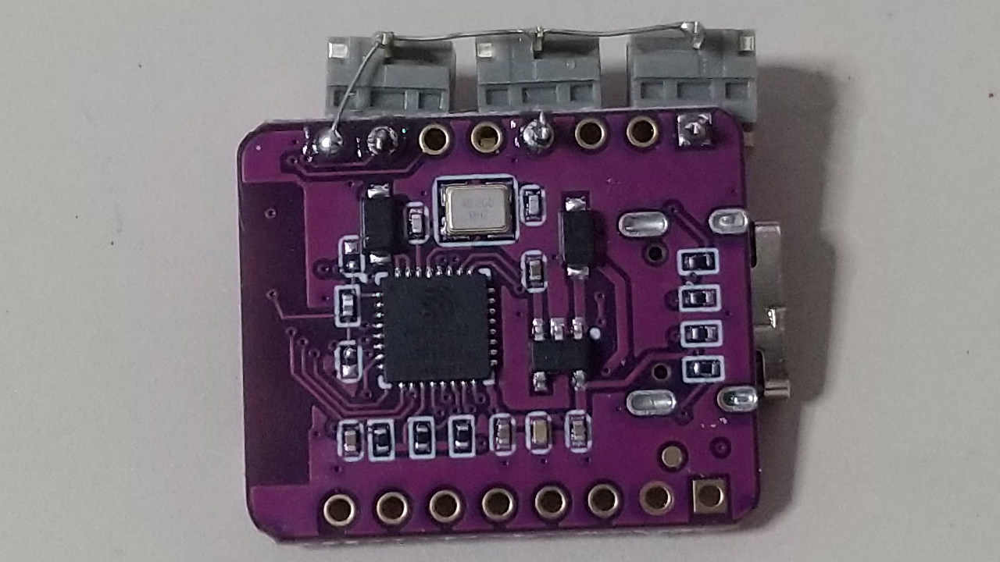

# esp32c2_oled_tetris
Miniature Tetris using ESP32 C3 OLED

## Wiring

Connect three microswitches directly to the ESP32-C3 board. 
All switches share GPIO 3 as a virtual GND (Drain pin).

| ESP32-C3 pin | Device | Pin / Note |
|--------------|--------|------------|
| GPIO 4       | Microswitch (Left)   | Side A |
| GPIO 7       | Microswitch (Right)  | Side A |
| GPIO 10      | Microswitch (Rotate) | Side A |
| GPIO 3       | All 3 Switches       | Side B (Shared Virtual GND) |

